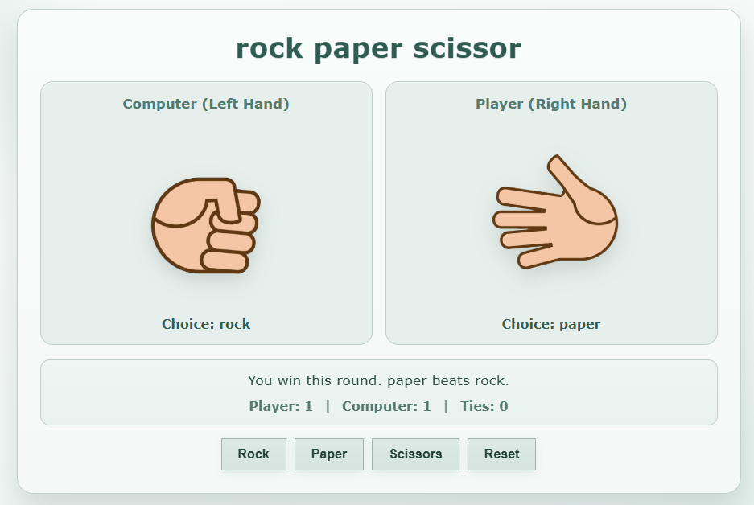

# Rock Paper Scissor

A simple Rock Paper Scissor game built with HTML, CSS, and JavaScript.

## Features

- Player vs computer gameplay
- 2-second suspense delay before round result
- Hand shake animation during reveal delay
- Running score for player, computer, and ties
- Reset button to restart instantly

## Project Structure

- index.html: page structure
- style.css: visual design and animations
- script.js: game logic and UI updates
- public/: hand graphics for player/computer choices
- Game.py: separate pygame-based game prototype

## Run the Web Game

1. Open index.html in a browser.
2. Or use VS Code Live Server for auto reload.

## Preview

